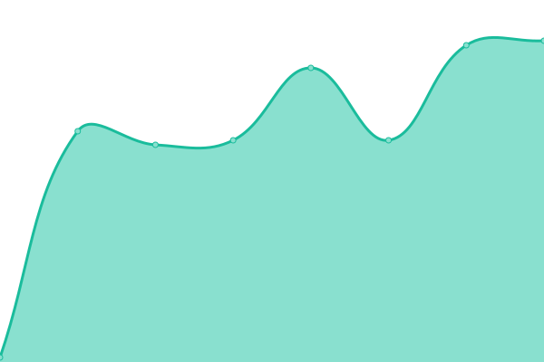

# [📈 Live Status](https://uptime.tuske.network): <!--live status--> **🟥 Complete outage**

This repository contains the open-source uptime monitor and status page for [tuskeNetwork](https://tuske.network), powered by [Upptime](https://github.com/upptime/upptime).

With [Upptime](https://upptime.js.org), you can get your own unlimited and free uptime monitor and status page, powered entirely by a GitHub repository. We use [Issues](https://github.com/tuskeNetwork/tuskeUptime/issues) as incident reports, [Actions](https://github.com/tuskeNetwork/tuskeUptime/actions) as uptime monitors, and [Pages](https://uptime.tuske.network) for the status page.

<!--start: status pages-->
<!-- This summary is generated by Upptime (https://github.com/upptime/upptime) -->
<!-- Do not edit this manually, your changes will be overwritten -->
<!-- prettier-ignore -->
| URL | Status | History | Response Time | Uptime |
| --- | ------ | ------- | ------------- | ------ |
|  [Website](https://tuske.network) | 🟥 Down | [website.yml](https://github.com/tuskeNetwork/tuskeUptime/commits/HEAD/history/website.yml) | 

 0ms
     
 | 

<a href="https://uptime.tuske.network/history/website">0.00%</a>
    

|  [Explorer](https://explorer.tuske.network) | 🟥 Down | [explorer.yml](https://github.com/tuskeNetwork/tuskeUptime/commits/HEAD/history/explorer.yml) | 

 0ms
     
 | 

<a href="https://uptime.tuske.network/history/explorer">0.00%</a>
    

|  [Seednode-USA](us.tuske.network) | 🟥 Down | [seednode-usa.yml](https://github.com/tuskeNetwork/tuskeUptime/commits/HEAD/history/seednode-usa.yml) | 

 0ms
     
 | 

<a href="https://uptime.tuske.network/history/seednode-usa">0.00%</a>
    

|  [Seednode-German](de.tuske.network) | 🟥 Down | [seednode-german.yml](https://github.com/tuskeNetwork/tuskeUptime/commits/HEAD/history/seednode-german.yml) | 

 0ms
     
 | 

<a href="https://uptime.tuske.network/history/seednode-german">0.00%</a>
    

|  [Seednode-Singapore](sg.tuske.network) | 🟥 Down | [seednode-singapore.yml](https://github.com/tuskeNetwork/tuskeUptime/commits/HEAD/history/seednode-singapore.yml) | 

 0ms
     
 | 

<a href="https://uptime.tuske.network/history/seednode-singapore">0.00%</a>
    

|  [Seednode-Australia](au.tuske.network) | 🟥 Down | [seednode-australia.yml](https://github.com/tuskeNetwork/tuskeUptime/commits/HEAD/history/seednode-australia.yml) | 

 0ms
     
 | 

<a href="https://uptime.tuske.network/history/seednode-australia">0.00%</a>
    

|  [Seednode-India](in.tuske.network) | 🟥 Down | [seednode-india.yml](https://github.com/tuskeNetwork/tuskeUptime/commits/HEAD/history/seednode-india.yml) | 

 0ms
     
 | 

<a href="https://uptime.tuske.network/history/seednode-india">0.00%</a>
    

|  [PublicNode-USA](node-us.tuske.network) | 🟥 Down | [public-node-usa.yml](https://github.com/tuskeNetwork/tuskeUptime/commits/HEAD/history/public-node-usa.yml) | 

 0ms
     
 | 

<a href="https://uptime.tuske.network/history/public-node-usa">0.00%</a>
    

|  [PublicNode-Japan](node-jp.tuske.network) | 🟥 Down | [public-node-japan.yml](https://github.com/tuskeNetwork/tuskeUptime/commits/HEAD/history/public-node-japan.yml) | 

 0ms
     
 | 

<a href="https://uptime.tuske.network/history/public-node-japan">0.00%</a>
    

<!--end: status pages-->

[**Visit our status website →**](https://uptime.tuske.network)

## 📄 License

- Powered by: [Upptime](https://github.com/upptime/upptime)
- Code: [MIT](./LICENSE) © [Anand Chowdhary](https://anandchowdhary.com), supported by [Pabio](https://pabio.com)
- Data in the `./history` directory: [Open Database License](https://opendatacommons.org/licenses/odbl/1-0/)
